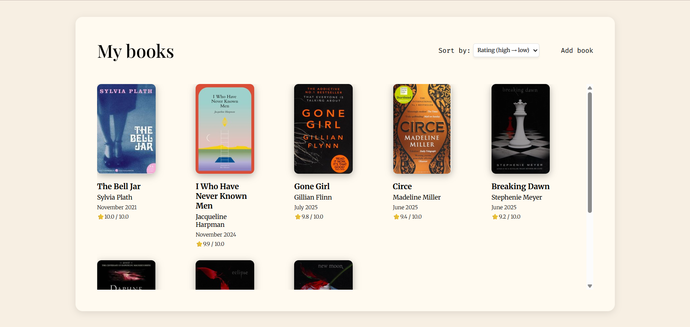
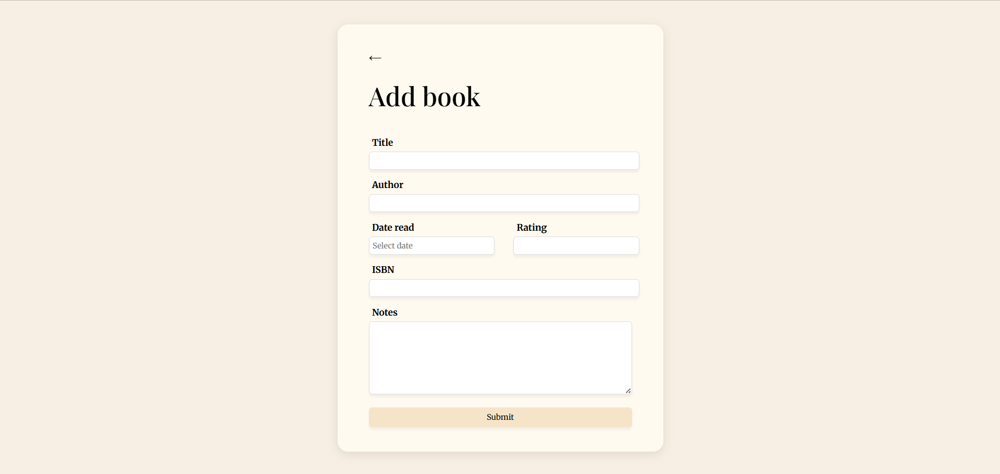
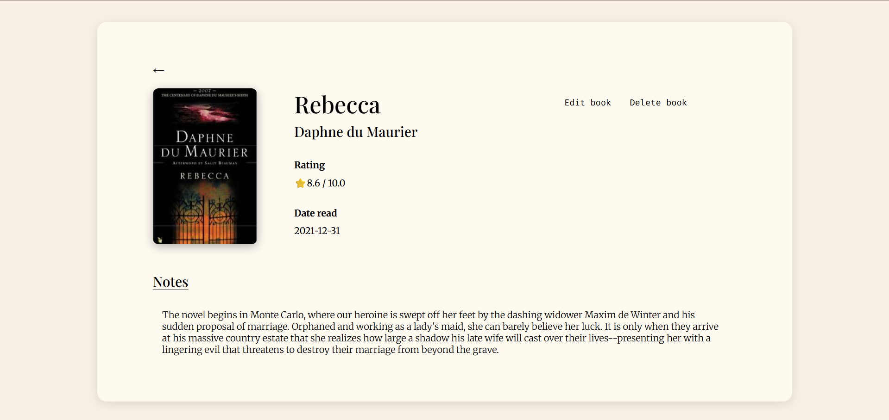
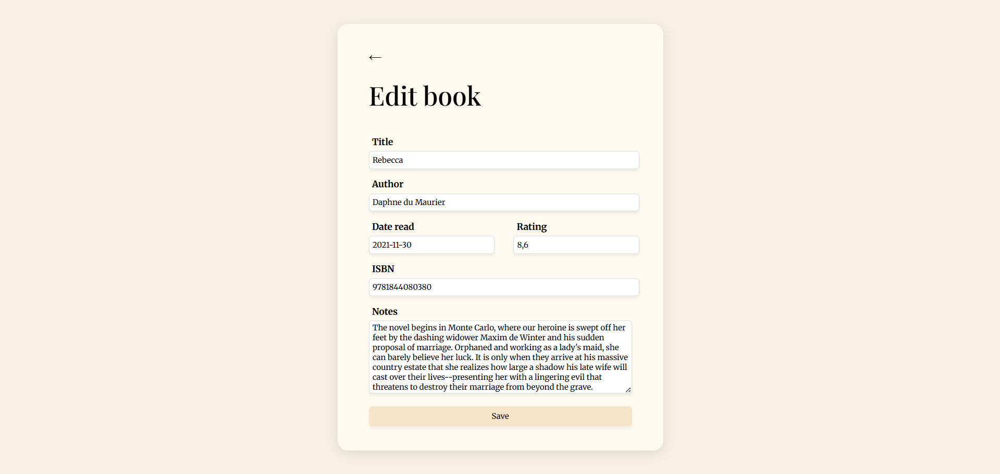

# 📚 Book Tacker App

A web application for managing books you've read – with the ability to add notes, ratings, and read dates.

This app was built to practice full-stack development with Node.js and PostgreSQL.

---

## Project Overview

This project helps you remember the key takeaways from books you've read. You can:

- Add a book with title, author, rating, notes, and date read
- Edit or delete existing book entries
- Sort books by rating or recency
- View book covers using the [Open Library Covers API](https://openlibrary.org/dev/docs/api/covers)

---

## Technologies Used

- Node.js with Express.js
- PostgreSQL (local database)
- pg (PostgreSQL client for Node.js)
- EJS (templating engine)
- HTML / CSS / JavaScript

---

## Getting Started

### 1. Clone the repository

```bash
git clone https://github.com/mateateglovic/book-tracker-app.git
cd book-tracker-app
```

### 2. Install dependencies

```bash
npm install
```

### 3. Set up environment variables

Create a `.env` file based on `.env.example`:

```bash
cp .env.example .env
```

Then fill in your PostgreSQL credentials:

```env
PORT=3000
DB_HOST=localhost
DB_PORT=5432
DB_USER=your_db_user
DB_PASSWORD=your_db_password
DB_NAME=book_app
```

### 4. Create the database and table

Create the database (if not already created):

```bash
createdb book_app

Then run the schema script:

````bash
psql -U your_user -d book_app -f schema.sql

---

### 5. Start the server

```bash
nodemon index.js
````

---

## Project Structure

```
📁 public/           - Static files (CSS, etc.)
📁 views/            - EJS templates
📁 db/               - Database connection logic
📄 index.js          - Main server entry point
📄 .env.example      - Example environment config
📄 README.md         - Project documentation
```

---

## Features

- Add, update, and delete books
- Sort books by rating or date read
- Display book covers using the Open Library Covers API

---

## Author

**Matea Teglović**  
GitHub: [@mateateglovic](https://github.com/mateateglovic)

---

## 📸 Screenshots

### Home Page

Displays all books with cover images, sorted by rating or date.


---

### Add Book Form

Allows users to submit a new book with details like title, author, date, rating, ISBN, and notes.


---

### Book Details View

Detailed view of a single book with options to edit or delete.


---

### Edit Book Form

Form to update an existing book’s details.


---

## Live App

👉 [https://book-tracker-app-atdb.onrender.com](https://book-tracker-app-atdb.onrender.com)
